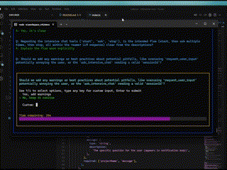

# Interactive MCP Enhanced

[](https://www.npmjs.com/package/interactive-mcp-enhanced) [](https://www.npmjs.com/package/interactive-mcp-enhanced) [](https://github.com/OwOHamper/interactive-mcp/blob/main/LICENSE) [](https://github.com/prettier/prettier) [](https://github.com/OwOHamper/interactive-mcp) [](https://github.com/OwOHamper/interactive-mcp/commits/main)

<a href="cursor://anysphere.cursor-deeplink/mcp/install?name=interactive&config=eyJjb21tYW5kIjoibnB4IiwiYXJncyI6WyIteSIsImludGVyYWN0aXZlLW1jcC1lbmhhbmNlZCJdfQ==">
  
</a>

_If the button doesn't work, make sure Cursor is installed and running, then manually copy the configuration below._

A MCP Server implemented in Node.js/TypeScript, facilitating interactive communication between LLMs and users. **Note:** This server is designed to run locally alongside the MCP client (e.g., Cursor, Claude Desktop), as it needs direct access to the user's operating system to display notifications and command-line prompts.

_Enhanced version based on the original [interactive-mcp](https://github.com/ttommyth/interactive-mcp) by [@ttommyth](https://github.com/ttommyth), with custom sound notifications, improved approval workflows, bug fixes, Terminal window management, parallel execution support, and enhanced user experience._

## Tools

This server exposes the following tools via the Model Context Protocol (MCP):

- `request_user_input`: Asks the user a question and returns their answer. Can display predefined options.
- `pending_approval_notification`: Sends loud alert notifications for actions requiring user approval.
- `start_intensive_chat`: Initiates a persistent command-line chat session.
- `ask_intensive_chat`: Asks a question within an active intensive chat session.
- `stop_intensive_chat`: Closes an active intensive chat session.

## Demo

Here are demonstrations of the interactive features:

|                      Normal Question                       |                       Pending Approval Alert                        |
| :--------------------------------------------------------: | :-----------------------------------------------------------------: |
|  |  |

|                         Intensive Chat Start                         |                        Intensive Chat End                        |
| :------------------------------------------------------------------: | :--------------------------------------------------------------: |
|  |  |

## Usage Scenarios

This server is ideal for scenarios where an LLM needs to interact directly with the user on their local machine, such as:

- Interactive setup or configuration processes.
- Gathering feedback during code generation or modification.
- Clarifying instructions or confirming actions in pair programming.
- **Alerting users before command execution** with loud notifications.
- Any workflow requiring user input or confirmation during LLM operation.

## Installation & Configuration

This section explains how to configure MCP clients to use the `interactive-mcp-enhanced` server.

By default, user prompts will time out after 5 minutes (300 seconds). You can customize server options like timeout or disabled tools by adding command-line flags directly to the `args` array when configuring your client.

Please make sure you have the `npx` command available.

### Usage with Cursor

Add the following configuration to your `~/.cursor/mcp.json`:

```json
{
  "mcpServers": {
    "interactive": {
      "command": "npx",
      "args": ["-y", "interactive-mcp-enhanced"]
    }
  }
}
```

**With Custom Timeout (5 minutes):**

```json
{
  "mcpServers": {
    "interactive": {
      "command": "npx",
      "args": ["-y", "interactive-mcp-enhanced", "--timeout", "300"]
    }
  }
}
```

**With Specific Version:**

```json
{
  "mcpServers": {
    "interactive": {
      "command": "npx",
      "args": ["-y", "interactive-mcp-enhanced@1.0.1"]
    }
  }
}
```

### Usage with Claude Desktop

Add the following configuration to your `claude_desktop_config.json`:

```json
{
  "mcpServers": {
    "interactive": {
      "command": "npx",
      "args": ["-y", "interactive-mcp-enhanced"]
    }
  }
}
```

#### macOS Recommendations

For a smoother experience on macOS using the default `Terminal.app`, consider this profile setting:

- **(Shell Tab):** Under **"When the shell exits"** (**Terminal > Settings > Profiles > _[Your Profile]_ > Shell**), select **"Close if the shell exited cleanly"** or **"Close the window"**. This helps manage windows when the MCP server starts and stops.

## Development Setup

This section is primarily for developers looking to modify or contribute to the server. If you just want to _use_ the server with an MCP client, see the "Client Configuration" section above.

### Prerequisites

- **Node.js:** Check `package.json` for version compatibility.
- **pnpm:** Used for package management. Install via `npm install -g pnpm` after installing Node.js.

### Installation (Developers)

1. Clone the repository:

   ```bash
   git clone https://github.com/OwOHamper/interactive-mcp.git
   cd interactive-mcp
   ```

2. Install dependencies:

   ```bash
   pnpm install
   ```

3. Build the project:

   ```bash
   pnpm build
   ```

### Running the Application (Developers)

```bash
pnpm start
```

### Custom Sound Notifications (Optional)

For custom notification sounds, you can:

1. **Local Development**: Place your own `alert.mp3` file in the project root directory
2. **Global Installation**: The server will use system sounds by default when installed via npx

The server will automatically detect and use your custom sound file if available.

#### Command-Line Options

The `interactive-mcp` server accepts the following command-line options. These should typically be configured in your MCP client's JSON settings by adding them directly to the `args` array (see "Client Configuration" examples).

| Option            | Alias | Description                              | Default |
| ----------------- | ----- | ---------------------------------------- | ------- |
| `--timeout`       | `-t`  | Timeout in seconds for user input        | 300     |
| `--disable-tools` | `-d`  | Disable specific tools (comma-separated) | none    |

**Example:** Setting multiple options in the client config `args` array:

```jsonc
// Example combining options in client config's "args":
"args": [
  "-y", "interactive-mcp-enhanced",
  "-t", "300", // Set timeout to 5 minutes
  "--disable-tools", "pending_approval_notification" // Disable approval notifications
]
```

## Development Commands

- **Build:** `pnpm build`
- **Lint:** `pnpm lint`
- **Format:** `pnpm format`

## Guiding Principles for Interaction

When interacting with this MCP server (e.g., as an LLM client), please adhere to the following principles to ensure clarity and reduce unexpected changes:

- **Prioritize Interaction:** Utilize the provided MCP tools (`request_user_input`, `start_intensive_chat`, etc.) frequently to engage with the user.
- **Seek Clarification:** If requirements, instructions, or context are unclear, **always** ask clarifying questions before proceeding. Do not make assumptions.
- **Confirm Actions:** Before performing significant actions (like modifying files, running complex commands, or making architectural decisions), confirm the plan with the user.
- **Alert Before Commands:** Always use `pending_approval_notification` before executing commands that require user approval.
- **Provide Options:** Whenever possible, present the user with predefined options through the MCP tools to facilitate quick decisions.

You can provide these instructions to an LLM client like this:

```markdown
# Interactive MCP Rules

## Interactive Communication

- Never ask questions in chat - always use `mcp_interactive_request_user_input` or intensive chat tools
- Keep conversations flowing - don't wait for manual user responses
- Use predefined options when possible for faster selection

## Pending Approval Notifications

- ALWAYS call `mcp_interactive_pending_approval_notification` in PARALLEL with commands that require user approval
- Commands requiring approval include:

  - `run_terminal_cmd` (ALL command executions)
  - File operations (delete, move, create in sensitive locations)
  - Git operations (push, pull, merge, reset)
  - Package installations (npm, pip, etc.)
  - Database operations
  - System modifications
  - Any potentially destructive action

- DO NOT use for automatic operations:
  - File edits (`search_replace`, `write`, `MultiEdit`)
  - Reading files (`read_file`)
  - Searching (`grep`, `codebase_search`)
  - Building/compiling code

## Execution Pattern

// CORRECT: Parallel execution for speed
mcp_interactive_pending_approval_notification({
projectName: "Context",
message: "About to execute: [specific command]"
})
run_terminal_cmd({ command: "[actual command]" })
```

## Features

- **🗨️ Interactive Prompts**: Ask questions with popup command-line interfaces
- **💬 Intensive Chat**: Multi-question sessions with persistent chat windows
- **🚨 Loud Alerts**: Attention-grabbing notifications for pending approvals
- **⏱️ Configurable Timeouts**: Custom timeout settings (default: 60 seconds)
- **🎵 Custom Sound**: Place `alert.mp3` in project root for your own notification sound
- **⚡ Parallel Execution**: Notifications and commands run simultaneously for speed
- **🪟 Single Window**: Fixed Terminal window management on macOS

## Platform Support

- **macOS**: Full support with Terminal windows and custom sound notifications
- **Windows/Linux**: Basic support with command prompts

## Contributing

Contributions are welcome! Please follow standard development practices and maintain compatibility with the original interactive-mcp design principles.

## Acknowledgments

This project is based on the original [interactive-mcp](https://github.com/ttommyth/interactive-mcp) by [@ttommyth](https://github.com/ttommyth). Enhanced with custom sound notifications, improved approval workflows, bug fixes, Terminal window management, parallel execution support, and enhanced user experience.

## License

MIT (See `LICENSE` file for details).
