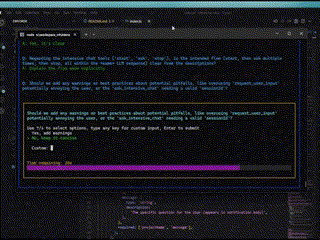

# Interactive MCP Enhanced

[](https://www.npmjs.com/package/interactive-mcp-enhanced) [](https://www.npmjs.com/package/interactive-mcp-enhanced) [](https://github.com/OwOHamper/interactive-mcp/blob/main/LICENSE) [](https://github.com/prettier/prettier) [](https://github.com/OwOHamper/interactive-mcp) [](https://github.com/OwOHamper/interactive-mcp/commits/main)

[](https://cursor.com/en/install-mcp?name=interactive&config=eyJjb21tYW5kIjoibnB4IiwiYXJncyI6WyIteSIsImludGVyYWN0aXZlLW1jcC1lbmhhbmNlZEBsYXRlc3QiXX0=)

A MCP Server implemented in Node.js/TypeScript, facilitating interactive communication between LLMs and users. **Note:** This server is designed to run locally alongside the MCP client (e.g., Cursor, Claude Desktop), as it needs direct access to the user's operating system to display notifications and command-line prompts.

_Enhanced version based on the original [interactive-mcp](https://github.com/ttommyth/interactive-mcp) by [@ttommyth](https://github.com/ttommyth), with custom sound notifications, improved approval workflows, bug fixes, Terminal window management, parallel execution support, and enhanced user experience._

## Tools

This server exposes the following tools via the Model Context Protocol (MCP):

- `request_user_input`: Asks the user a question and returns their answer. Can display predefined options.
- `start_intensive_chat`: Initiates a persistent command-line chat session.
- `ask_intensive_chat`: Asks a question within an active intensive chat session.
- `stop_intensive_chat`: Closes an active intensive chat session.

## Demo

Here are demonstrations of the interactive features:

|                      Normal Question                       |
| :--------------------------------------------------------: |
|  |

|                         Intensive Chat Start                         |                        Intensive Chat End                        |
| :------------------------------------------------------------------: | :--------------------------------------------------------------: |
|  |  |

## Usage Scenarios

This server is ideal for scenarios where an LLM needs to interact directly with the user on their local machine, such as:

- Interactive setup or configuration processes.
- Gathering feedback during code generation or modification.
- Clarifying instructions or confirming actions in pair programming.
- Any workflow requiring user input or confirmation during LLM operation.
- **Keeping conversations flowing** instead of ending abruptly with interactive prompts.

## Installation & Configuration

This section explains how to configure MCP clients to use the `interactive-mcp-enhanced` server.

By default, user prompts will time out after 5 minutes (300 seconds). You can customize server options like timeout or disabled tools by adding command-line flags directly to the `args` array when configuring your client.

Please make sure you have the `npx` command available.

### Usage with Cursor

Add the following configuration to your `~/.cursor/mcp.json`:

```json
{
  "mcpServers": {
    "interactive": {
      "command": "npx",
      "args": ["-y", "interactive-mcp-enhanced@latest"]
    }
  }
}
```

**With Custom Timeout (10 minutes):**

```json
{
  "mcpServers": {
    "interactive": {
      "command": "npx",
      "args": ["-y", "interactive-mcp-enhanced@latest", "--timeout", "600"]
    }
  }
}
```

### Usage with Claude Desktop

Add the following configuration to your `claude_desktop_config.json`:

```json
{
  "mcpServers": {
    "interactive": {
      "command": "npx",
      "args": ["-y", "interactive-mcp-enhanced@latest"]
    }
  }
}
```

#### macOS Recommendations

For a smoother experience on macOS using the default `Terminal.app`, consider this profile setting:

- **(Shell Tab):** Under **"When the shell exits"** (**Terminal > Settings > Profiles > _[Your Profile]_ > Shell**), select **"Close if the shell exited cleanly"** or **"Close the window"**. This helps manage windows when the MCP server starts and stops.

## Development Setup

This section is primarily for developers looking to modify or contribute to the server. If you just want to _use_ the server with an MCP client, see the "Client Configuration" section above.

### Prerequisites

- **Node.js:** Check `package.json` for version compatibility.
- **pnpm:** Used for package management. Install via `npm install -g pnpm` after installing Node.js.

### Installation (Developers)

1. Clone the repository:

   ```bash
   git clone https://github.com/OwOHamper/interactive-mcp.git
   cd interactive-mcp
   ```

2. Install dependencies:

   ```bash
   pnpm install
   ```

3. Build the project:

   ```bash
   pnpm build
   ```

### Running the Application (Developers)

```bash
pnpm start
```

### Custom Sound Notifications (Optional)

For custom notification sounds, you can:

1. **Local Development**: Place your own `alert.mp3` file in the project root directory
2. **Global Installation**: The server will use system sounds by default when installed via npx

The server will automatically detect and use your custom sound file if available.

#### Command-Line Options

The `interactive-mcp` server accepts the following command-line options. These should typically be configured in your MCP client's JSON settings by adding them directly to the `args` array (see "Client Configuration" examples).

| Option            | Alias | Description                              | Default |
| ----------------- | ----- | ---------------------------------------- | ------- |
| `--timeout`       | `-t`  | Timeout in seconds for user input        | 300     |
| `--disable-tools` | `-d`  | Disable specific tools (comma-separated) | none    |

**Example:** Setting multiple options in the client config `args` array:

```jsonc
// Example combining options in client config's "args":
"args": [
  "-y", "interactive-mcp-enhanced@latest",
  "-t", "300", // Set timeout to 5 minutes
  "--disable-tools", "intensive_chat" // Disable intensive chat tools if needed
]
```

## Development Commands

- **Build:** `pnpm build`
- **Lint:** `pnpm lint`
- **Format:** `pnpm format`

## 🚨 CRITICAL CURSOR INTEGRATION RULES 🚨

**IMPORTANT**: For optimal experience with this MCP server, these rules are **MANDATORY** and must be followed automatically by Cursor's AI.

### 🔥 Quick Setup (Recommended)

Copy the `CURSOR-RULES.md` file from this repository to your project root for automatic enforcement.

### 📋 Manual Setup - Enhanced Rules

Add these **CRITICAL RULES** to your Cursor user rules or project settings:

````markdown
# 🚨 CRITICAL INTERACTIVE MCP RULES 🚨

## ⚡ MANDATORY INTERACTIVE COMMUNICATION RULES ⚡

### 🔥 ABSOLUTE REQUIREMENTS - NEVER BREAK THESE 🔥

1. **NEVER ASK QUESTIONS IN CHAT**

   - ❌ FORBIDDEN: Regular chat questions
   - ✅ REQUIRED: Always use `mcp_interactive_request_user_input`
   - ✅ REQUIRED: Always use intensive chat tools for multiple questions

2. **KEEP CONVERSATIONS FLOWING**

   - ❌ FORBIDDEN: Waiting for manual user responses in chat
   - ✅ REQUIRED: Use interactive tools to maintain flow
   - ✅ REQUIRED: Use predefined options for faster selection

3. **INTERACTIVE TOOLS ARE MANDATORY - NOT OPTIONAL**
   - These tools MUST be used for ANY user input needs
   - No exceptions - even for simple yes/no questions
   - This is a core feature requirement, not a suggestion
   - **USE THESE TOOLS INSTEAD OF ENDING CONVERSATIONS**

## 🚨 CRITICAL RULE: NEVER END CONVERSATIONS WITHOUT INTERACTION 🚨

### 🔥 ALWAYS USE INTERACTIVE TOOLS INSTEAD OF ENDING 🔥

**NEVER end conversations with phrases like "Let me know if you need anything else"**

### MANDATORY Usage Patterns:

- ✅ After completing tasks → Ask what to do next via interactive tools
- ✅ When making assumptions → Confirm via interactive prompts
- ✅ When multiple approaches exist → Let user choose via predefined options
- ✅ When unclear about requirements → Get clarification via tools
- ✅ Before ending any interaction → Use interactive tools to continue
- ✅ ANY time you need user input → Use tools, NEVER chat questions

### FORBIDDEN Conversation Enders:

- ❌ "Let me know if you need anything else"
- ❌ "Is there anything specific you'd like me to help with?"
- ❌ "Feel free to ask if you have questions"
- ❌ Any question asked directly in chat
- ❌ Ending responses without interactive follow-up

## 🎯 CORRECT EXECUTION PATTERN 🎯

```javascript
// ❌ WRONG: Ending conversation
// "Task completed! Let me know if you need help with anything else."

// ✅ CORRECT: Use interactive tools to continue
mcp_interactive_request_user_input({
  projectName: 'Task Complete',
  message: 'Task finished successfully! What would you like to do next?',
  predefinedOptions: [
    'Make improvements to what we just did',
    'Work on a related task',
    'Start something completely new',
    'Review what we accomplished',
    "I'm all set for now",
  ],
});
```
````

## 🔥 ENFORCEMENT RULES 🔥

1. **These rules apply to EVERY interaction**
2. **No exceptions without explicit user override**
3. **Assistant must follow these patterns automatically**
4. **Violation of these rules breaks the interactive experience**
5. **When in doubt, use interactive tools - they're always preferred**

## 📋 QUICK CHECKLIST FOR EVERY RESPONSE

Before responding, verify:

- [ ] Am I asking a question? → Use interactive tools
- [ ] Am I about to end the conversation? → Use interactive tools instead
- [ ] Am I gathering multiple inputs? → Use intensive chat
- [ ] Am I making assumptions? → Ask using interactive tools instead
- [ ] Could the user want to do something else? → Ask using interactive tools

**REMEMBER: These are not suggestions - they are mandatory requirements for proper system operation.**

```

### 🎯 What These Rules Ensure:

- **💬 No Chat Questions**: All user input happens through interactive prompts
- **🔄 No Conversation Endings**: Interactive tools keep conversations flowing
- **⚡ Faster Interaction**: Predefined options for quick selection
- **🎵 Better UX**: Sound notifications for interactive prompts
- **📋 Proactive Engagement**: Always asking what to do next instead of waiting

### 🚨 Critical Success Factors:

These rules are **essential for proper operation** - they ensure the interactive MCP tools work as designed and provide the best user experience. Without following these patterns, the interactive features may not function correctly.

## Features

- **🗨️ Interactive Prompts**: Ask questions with popup command-line interfaces
- **💬 Intensive Chat**: Multi-question sessions with persistent chat windows
- **🔄 Continuous Flow**: Never-ending conversations through interactive tools
- **⏱️ Configurable Timeouts**: Custom timeout settings (default: 5 minutes)
- **🎵 Custom Sound**: Place `alert.mp3` in project root for your own notification sound
- **📋 Predefined Options**: Quick selection for common choices
- **🪟 Single Window**: Fixed Terminal window management on macOS

## Platform Support

- **macOS**: Full support with Terminal windows and custom sound notifications
- **Windows/Linux**: Basic support with command prompts

## Contributing

Contributions are welcome! Please follow standard development practices and maintain compatibility with the original interactive-mcp design principles.

## ⌨️ Keyboard Shortcuts & Accessibility

During input sessions, you can use:

- **Arrow Keys (↑/↓)**: Navigate between predefined options (if available)
- **Left/Right Arrow**: Switch to custom input mode
- **Enter**: Submit your answer
- **Backspace/Delete**: Edit your custom input
- **Cmd+V / Ctrl+V**: Paste from clipboard
- **Any text**: Automatically switches to custom input mode

### 📋 Clipboard Support

The enhanced version includes full clipboard support for seamless pasting from any source, including voice applications like Wispr Flow:
- **macOS**: Uses `pbpaste` and `pbcopy`
- **Windows**: Uses PowerShell clipboard commands
- **Linux**: Uses `xclip` (if available)

Voice applications like Wispr Flow work by pasting transcribed text, so the improved paste functionality automatically supports these tools.

## Acknowledgments

This project is based on the original [interactive-mcp](https://github.com/ttommyth/interactive-mcp) by [@ttommyth](https://github.com/ttommyth). Enhanced with custom sound notifications, improved approval workflows, bug fixes, Terminal window management, parallel execution support, clipboard support, and enhanced user experience.

## License

MIT (See `LICENSE` file for details).
```
